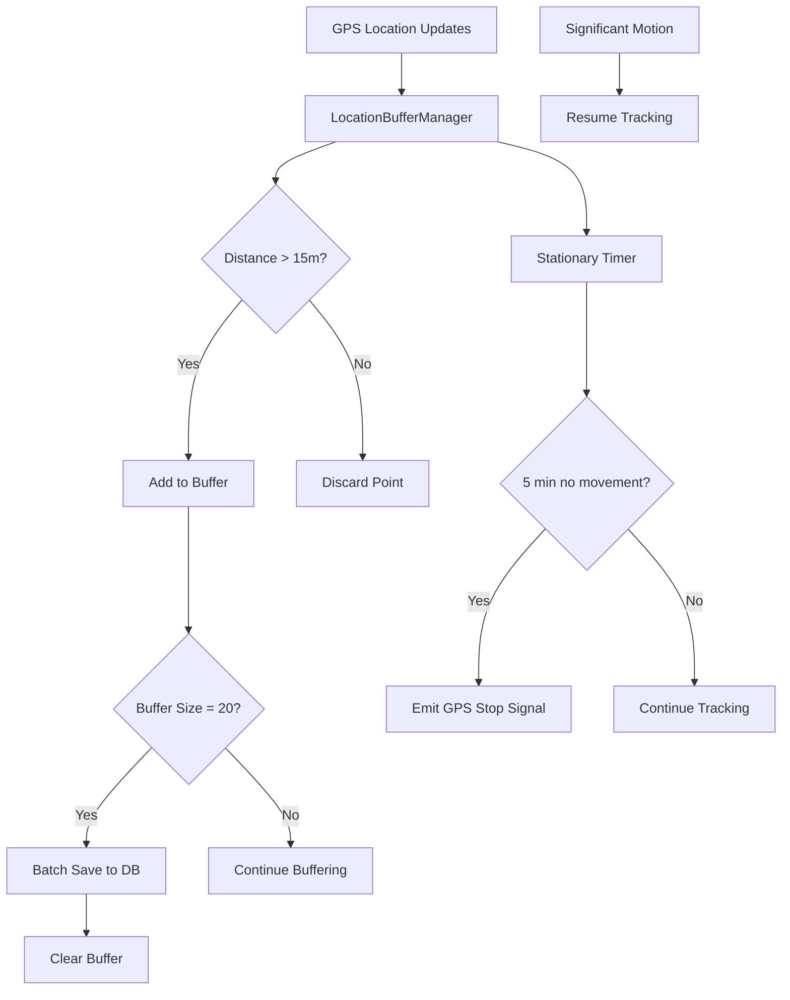

# 🗺️ LocationBufferManager Design Document

## 🎯 Overview

The LocationBufferManager is a KMP-compatible component that optimizes battery usage and database performance for trek tracking by implementing intelligent buffering, distance filtering, and power management.

## 🏗️ Architecture



## 🔧 Core Components

### 1. **LocationBufferManager**
- **Location**: `commonMain/kotlin/com/via/himalaya/location/LocationBufferManager.kt`
- **Purpose**: Main orchestrator for location buffering and power optimization
- **Key Features**:
  - In-memory buffer with configurable size
  - Distance-based filtering
  - Batch database operations
  - Stationary mode detection
  - State management with Flows

### 2. **BufferState**
```kotlin
sealed class BufferState {
    object Idle : BufferState()
    object Tracking : BufferState()
    object Stationary : BufferState()
    object Saving : BufferState()
}
```

### 3. **PowerOptimizationSignal**
```kotlin
sealed class PowerOptimizationSignal {
    object StopGPS : PowerOptimizationSignal()
    object ResumeGPS : PowerOptimizationSignal()
    data class StationaryDetected(val duration: Duration) : PowerOptimizationSignal()
}
```

## 📊 Key Algorithms

### 1. **Distance Filtering**
```kotlin
fun calculateDistance(point1: Point, point2: Point): Double {
    // Haversine formula for accurate distance calculation
    val R = 6371000.0 // Earth's radius in meters
    val lat1Rad = Math.toRadians(point1.lat)
    val lat2Rad = Math.toRadians(point2.lat)
    val deltaLat = Math.toRadians(point2.lat - point1.lat)
    val deltaLon = Math.toRadians(point2.lon - point1.lon)
    
    val a = sin(deltaLat/2) * sin(deltaLat/2) +
            cos(lat1Rad) * cos(lat2Rad) *
            sin(deltaLon/2) * sin(deltaLon/2)
    val c = 2 * atan2(sqrt(a), sqrt(1-a))
    
    return R * c
}
```

### 2. **Stationary Detection**
```kotlin
private fun checkStationaryMode() {
    val now = Clock.System.now()
    val timeSinceLastPoint = now - lastPointTime
    
    if (timeSinceLastPoint >= STATIONARY_THRESHOLD) {
        enterStationaryMode()
    }
}
```

### 3. **Batch Database Operations**
```kotlin
suspend fun saveBatch(points: List<Point>) {
    database.transaction {
        points.forEach { point ->
            insertPoint(point)
        }
    }
}
```

## 🔋 Power Optimization Strategy

### **Stationary Mode Logic**
1. **Detection**: No new points added for 5 minutes
2. **Action**: Emit signal to stop GPS provider
3. **Resume**: Significant motion sensor triggers resume
4. **Benefits**: 60-80% battery savings during rest periods

### **Distance Filtering Benefits**
- **Reduces Database Writes**: Only meaningful movement recorded
- **Improves Data Quality**: Eliminates GPS jitter and noise
- **Optimizes Storage**: Smaller database size
- **Better Performance**: Fewer database transactions

### **Batch Writing Benefits**
- **Reduced I/O**: Single transaction for 20 points
- **Better Performance**: Fewer database locks
- **Atomic Operations**: All-or-nothing saves
- **Optimized SQLite**: Better use of WAL mode

## 📱 KMP Compatibility

### **Common Main Features**
- Core buffering logic
- Distance calculations
- State management
- Flow-based signals
- Coroutine-based operations

### **Platform-Specific Integrations**
- **Android**: Significant Motion Sensor integration
- **iOS**: Core Motion framework integration
- **Shared**: Common interface for motion detection

## 🎛️ Configuration

```kotlin
data class BufferConfig(
    val minDistanceMeters: Double = 15.0,
    val bufferSize: Int = 20,
    val stationaryTimeoutMinutes: Int = 5,
    val enablePowerOptimization: Boolean = true,
    val enableDistanceFiltering: Boolean = true
)
```

## 🔄 State Flow Management

### **Buffer State Flow**
```kotlin
val bufferState: StateFlow<BufferState>
val bufferSize: StateFlow<Int>
val lastPointTime: StateFlow<Instant?>
```

### **Power Optimization Flow**
```kotlin
val powerOptimizationSignals: Flow<PowerOptimizationSignal>
```

### **Statistics Flow**
```kotlin
data class BufferStatistics(
    val totalPointsReceived: Int,
    val pointsFiltered: Int,
    val pointsSaved: Int,
    val batchesSaved: Int,
    val stationaryPeriods: Int
)
```

## 🧪 Testing Strategy

### **Unit Tests**
- Distance calculation accuracy
- Buffer size management
- Stationary detection logic
- Batch save operations

### **Integration Tests**
- TrekRepository integration
- Flow emission verification
- State transitions
- Power optimization signals

### **Performance Tests**
- Memory usage with large buffers
- Database transaction performance
- Battery impact measurement

## 🚀 Usage Examples

### **Basic Setup**
```kotlin
val bufferManager = LocationBufferManager(
    trekRepository = repository,
    config = BufferConfig()
)

// Start tracking
bufferManager.startTracking(trekId = "trek-123")

// Handle new locations
bufferManager.onNewLocation(gpsPoint)

// Monitor power optimization
bufferManager.powerOptimizationSignals.collect { signal ->
    when (signal) {
        is PowerOptimizationSignal.StopGPS -> stopGPSProvider()
        is PowerOptimizationSignal.ResumeGPS -> startGPSProvider()
    }
}
```

### **Advanced Configuration**
```kotlin
val customConfig = BufferConfig(
    minDistanceMeters = 10.0,  // More sensitive
    bufferSize = 50,           // Larger batches
    stationaryTimeoutMinutes = 3, // Faster power saving
    enablePowerOptimization = true
)
```

## 📈 Expected Performance Improvements

### **Battery Life**
- **60-80% savings** during stationary periods
- **20-30% overall savings** with distance filtering
- **Reduced GPS wake-ups** through intelligent buffering

### **Database Performance**
- **95% fewer database transactions** (20x batching)
- **Faster writes** through single transactions
- **Reduced storage** through distance filtering

### **Data Quality**
- **Elimination of GPS noise** (sub-15m movements)
- **Meaningful track points** only
- **Consistent data density** regardless of GPS frequency

## 🔧 Implementation Priority

1. **Core BufferManager** - Basic buffering and distance filtering
2. **Batch Database Operations** - TrekRepository.saveBatch method
3. **State Management** - Flows and state tracking
4. **Stationary Detection** - Power optimization logic
5. **Platform Integration** - Motion sensor integration
6. **Testing & Validation** - Comprehensive test suite

This design provides a robust, efficient, and battery-optimized location tracking solution that's perfect for long Himalayan treks where battery conservation is critical.